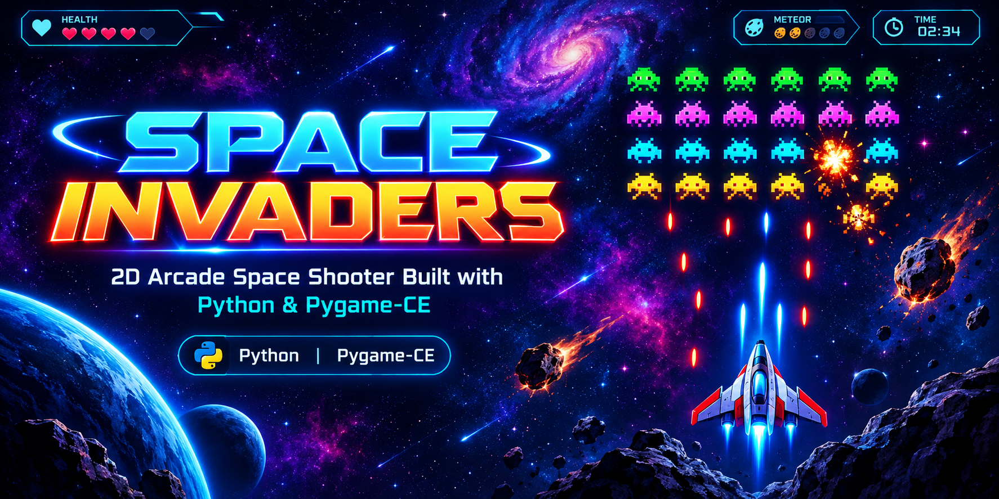
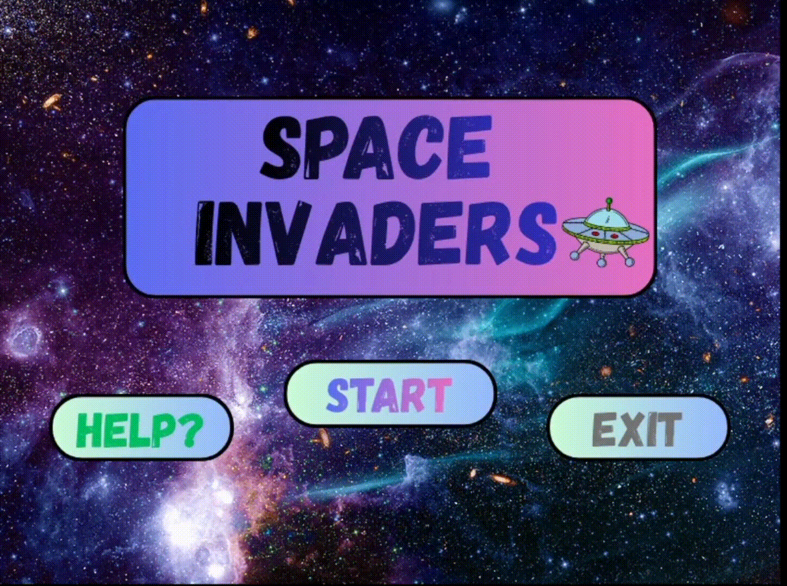
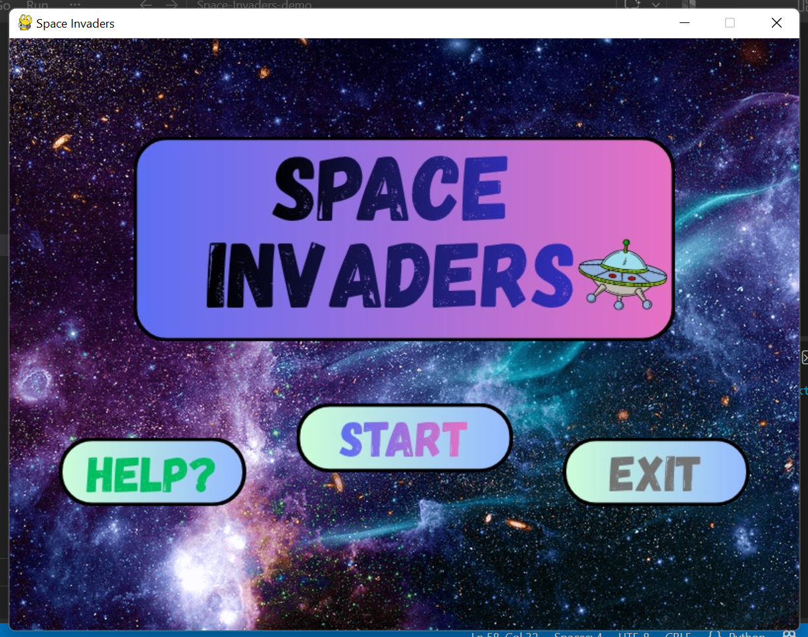
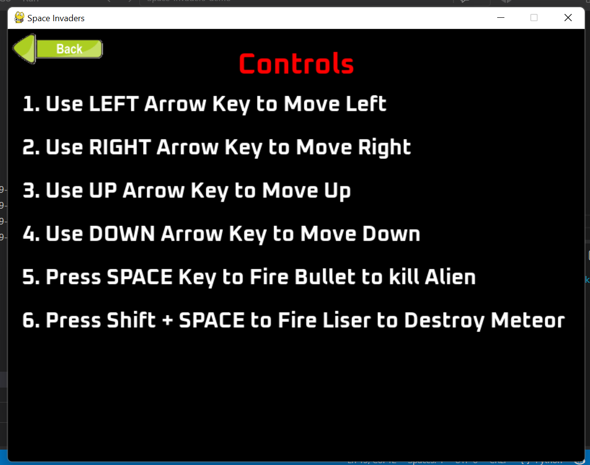
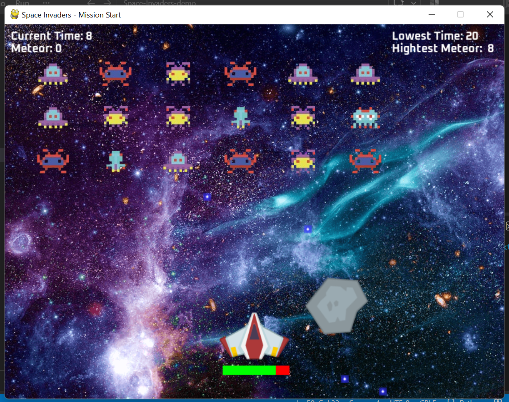
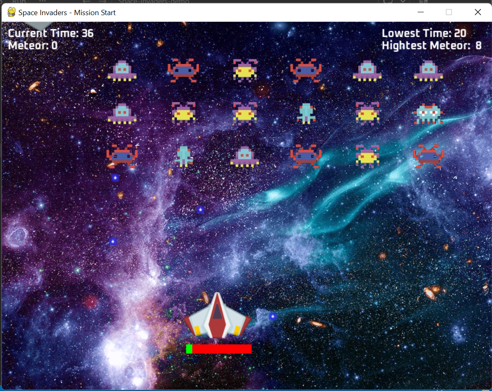
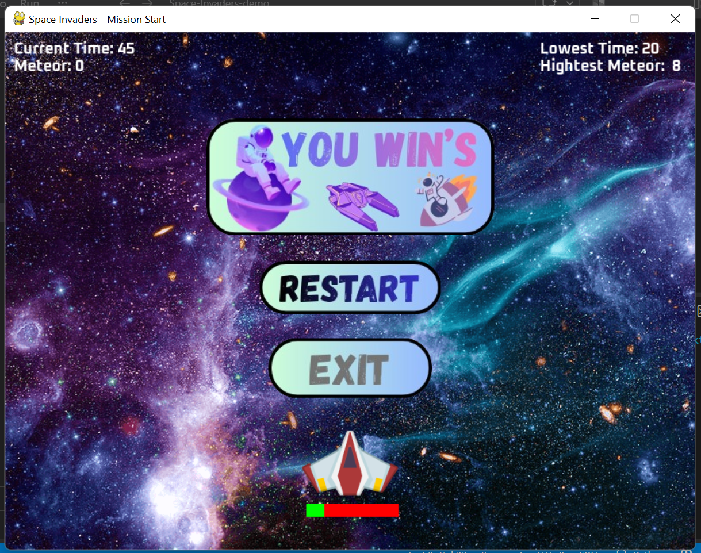
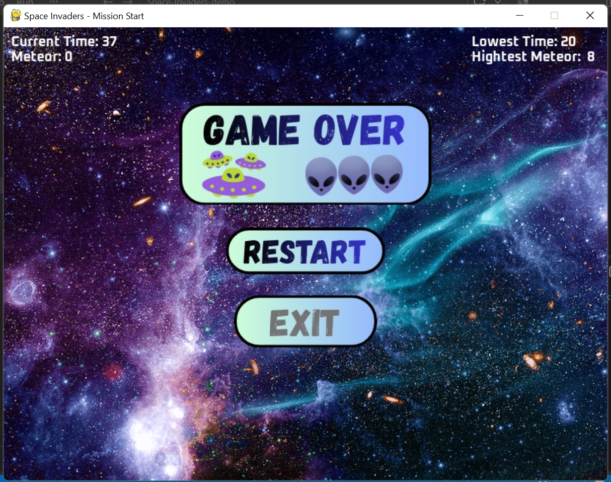

# ☄️Space Invaders



A **Classic-Style 2D Space Shooter** built with **Python** and **Pygame Community Edition (pygame-ce)**.Destroy the **Alien fleet**, Defend your **Spaceship** from **Enemy Fire** and **Meteors**, and complete the **Mission** as **Quickly** as possible.

            

---

## 📌 Project Overview

**Space Invaders** is a 2D arcade-style space shooter developed using **Python** and **Pygame Community Edition (pygame-ce)**.

The player controls a spaceship and must eliminate a formation of **18 aliens** while surviving enemy bullets and falling meteors. The game includes two weapon types, animated explosions, a health system, persistent gameplay records, multiple UI screens, sound effects, and restart/exit functionality.

The project is organized into modular Python classes and sprite groups, keeping gameplay entities, asset management, UI buttons, controls, and mission logic separated into dedicated modules.

---

## 🎮 Gameplay

The mission begins with a formation of **3 rows × 6 columns of aliens**.

The player can move the spaceship in four directions and use two different weapons:

- 🔫 **Bullet** — used to destroy aliens
- ⚡ **Laser** — used to destroy meteors
- 👾 Alien bullets damage the spaceship
- ☄️ Meteors appear periodically and can also damage the spaceship
- ❤️ The spaceship starts with **10 health**
- 🏆 Destroying all aliens results in a victory
- 💀 Losing all spaceship health results in Game Over

The game also tracks mission time and meteor destruction records.

{width=800px}

---

## 📸 Screenshots

### 🏠 Main Menu

{width=800px}

The main menu provides access to **Start**, **Help**, and **Exit**.

---

### 🎮 Controls / Help Screen

{width=800px}

The Help screen displays movement and weapon controls.

---

### 👾 Battle Screen

{width=800px}

The active mission contains the alien formation, spaceship, health bar, meteor hazards, projectiles, and gameplay HUD.

---

### ❤️ Low Health State

{width=800px}

The health bar provides immediate visual feedback as the spaceship takes damage.

---

### 🏆 Victory Screen

{width=800px}

The victory state appears after all aliens have been eliminated.

---

### 💀 Game Over Screen

{width=800px}

The Game Over state appears when the spaceship's health reaches zero.

---

## 📁 Project Structure

```text
Space-Invaders/
│
├── README.md
├── requirements.txt
│
├── Src/
│   ├── Alien.py
│   ├── Assets.py
│   ├── button.py
│   ├── Help.py
│   ├── Main.py
│   ├── Mission.py
│   └── Spaceship.py
│
├── Screenshots/
│   ├── battle_screen.png
│   ├── gameover.png
│   ├── help_screen.png
│   ├── low_hp.png
│   ├── main_menu.png
│   ├── Sapace_Invaders_GamePlay.gif
│   └── winner.png
│
└── Assets/
    ├── Sounds/
    │   ├── bullet.wav
    │   ├── click.wav
    │   ├── damage.ogg
    │   ├── explosion.wav
    │   ├── explosion_1.wav
    │   ├── game_music.wav
    │   └── laser.wav
    │
    ├── Scores-Files/
    │   ├── highest_meteor.txt
    │   └── lowest_time.txt
    │
    ├── Fonts/
    │   └── Oxanium-Bold.ttf
    │
    └── Images/
        ├── Player/
        ├── Explosion/
        ├── Enemy/
        └── UI/
```

---

## ✨ Key Features

### 🚀 Player Spaceship

- Four-directional movement using the arrow keys
- Normalized diagonal movement
- Screen-boundary restrictions
- 10-point starting health
- Real-time visual health bar
- Automatic spaceship reset when the mission ends

### 🔫 Dual Weapon System

The spaceship supports two firing modes:

| Weapon | Control | Target |
|---|---|---|
| 🔫 Bullet | `SPACE` | Aliens |
| ⚡ Laser | `SHIFT + SPACE` | Meteors |

Both weapons use a shared firing cooldown system with a **400 ms cooldown**.

### 👾 Alien Fleet

- 18 aliens generated in a `3 × 6` formation
- Multiple alien image variants
- Automatic horizontal movement
- Direction reversal after a movement interval
- Random alien selected for firing
- Alien projectiles are removed when they leave the screen

### ☄️ Meteor Hazards

- Meteors spawn through a custom Pygame timer event
- Randomized horizontal direction
- Randomized movement speed
- Rotational animation
- Limited lifetime of 3 seconds
- Laser collisions destroy meteors
- Meteor collisions deal **2 health damage**

### 💥 Explosion System

The project uses frame-based animated explosions for:

- Alien destruction
- Meteor destruction
- Spaceship damage
- Spaceship destruction

Explosion frames and sounds are centrally managed through the asset system.

### ❤️ Health & Damage System

The spaceship starts with:

```text
Health: 10 / 10
```

Damage sources:

- Alien bullet → **-1 health**
- Meteor collision → **-2 health**

A visual health bar dynamically reflects the remaining health.

### 🏆 Mission Records

The game maintains two persistent records using text files:

- ⏱️ **Lowest Time** — fastest recorded mission completion time
- ☄️ **Highest Meteor** — highest number of meteors destroyed

These values are loaded when a mission starts and updated when a new record is achieved.

### 🖥️ UI & Game States

The game includes:

- Main Menu
- Controls / Help screen
- Active Mission / Battle screen
- Low Health gameplay state
- Victory screen
- Game Over screen
- Restart option
- Exit option

### 🔊 Audio System

The project includes dedicated audio assets for:

- Background music
- Button clicks
- Bullet firing
- Laser firing
- Alien explosions
- Meteor explosions
- Player damage

### 🎨 Custom Visual Assets

The game uses custom asset categories for:

- Player spaceship and weapons
- Alien sprites
- Enemy bullets
- Meteors
- Explosion animation frames
- Main menu UI
- Win/Lose banners
- Space background
- Oxanium Bold font

---

## 🕹️ Controls

| Key | Action |
|---|---|
| `←` | Move Left |
| `→` | Move Right |
| `↑` | Move Up |
| `↓` | Move Down |
| `SPACE` | Fire Bullet |
| `SHIFT + SPACE` | Fire Laser |
| Mouse Left Click | Interact with UI Buttons |

> **Tip:** Use the **Bullet** against aliens and the **Laser** against meteors.

---

## 🏁 Win & Game Over Conditions

### 🏆 Victory

The player wins when:

```text
All 18 aliens are destroyed
```

The game then displays the victory banner and provides options to:

- Restart the mission
- Exit the game

If the completed mission is faster than the stored lowest time, the new time is saved as the latest record.

### 💀 Game Over

The player loses when:

```text
Spaceship Health <= 0
```

The Game Over screen provides:

- Restart
- Exit

---

## 📊 In-Game HUD

During the mission, the HUD displays:

### Top Left

- **Current Time**
- **Meteor** — number of meteors destroyed during the current mission

### Top Right

- **Lowest Time** — best recorded mission time
- **Highest Meteor** — highest recorded number of meteors destroyed

This creates a simple performance-tracking system without relying on a conventional point-based score.

---

## 🧩 Technical Architecture

The project follows a modular structure where each Python file has a focused responsibility.

### Core Modules

| File | Responsibility |
|---|---|
| `Main.py` | Initializes the game, manages the main menu, and launches Help/Mission screens |
| `Mission.py` | Main gameplay loop, mission state, collisions, HUD, records, win/lose logic, and restart flow |
| `Spaceship.py` | Player spaceship, movement, health, weapons, laser, and explosion animation |
| `Alien.py` | Alien, alien bullet, and meteor gameplay entities |
| `Assets.py` | Centralized loading of images, sounds, fonts, paths, and colors |
| `button.py` | Reusable image-based button component with hover and click handling |
| `Help.py` | Controls / Help screen |

---

## 🏗️ Sprite-Based Design

Gameplay entities are implemented using `pygame.sprite.Sprite` and organized into dedicated sprite groups.

The mission manages separate groups for:

```text
Spaceship
Bullets
Lasers
Meteors
Aliens
Alien Bullets
Explosions
```

This makes updating, drawing, collision detection, and entity cleanup easier to manage.

Collision detection uses Pygame sprite collision utilities with mask-based collision checks where appropriate.

---

## ⏱️ Event & Timing System

The project uses Pygame timing mechanisms for gameplay events.

### Game Loop

- Window resolution: **800 × 600**
- Target frame rate: **60 FPS**

### Alien Firing

Aliens use a firing cooldown of:

```text
1000 ms
```

The mission limits active alien bullets to fewer than five at a time.

### Meteor Spawning

A custom Pygame event triggers meteor spawn checks every:

```text
1000 ms
```

A random probability check determines whether a meteor is created.

### Weapon Cooldown

The spaceship uses a:

```text
400 ms
```

firing cooldown.

---

## 💾 Persistent Records

Records are stored in:

```text
Assets/Scores-Files/
├── highest_meteor.txt
└── lowest_time.txt
```

The game automatically creates the files with an initial value of `0` if they do not already exist.

This allows records to persist between game sessions.

---

## 🛠️ Tech Stack

### Programming Language
- **Python**

### Game Development
- **Pygame Community Edition (pygame-ce)**

### Programming Concepts
- Object-Oriented Programming
- Classes & Inheritance
- Pygame Sprite System
- Sprite Groups
- Event Handling
- Collision Detection
- Keyboard Input
- Timers & Cooldowns
- Animation
- File I/O
- Modular Code Organization

### Game Systems
- Player movement
- Projectile systems
- Enemy AI movement
- Meteor spawning
- Health management
- Collision handling
- Animated explosions
- Audio management
- Persistent records
- UI state management

---

## ⚙️ Installation & Setup

### 1. Clone the Repository

```bash
git clone https://github.com/Harsh-Belekar/Space-Invaders
cd Space-Invaders
```

### 2. Create a Virtual Environment

```bash
python -m venv venv
```

Activate it on Windows:

```bash
venv\Scripts\activate
```

On macOS/Linux:

```bash
source venv/bin/activate
```

### 3. Install Dependencies

```bash
pip install -r requirements.txt
```

### 4. Run the Game

Run the game from the **repository root directory** so that the relative `Assets/` paths resolve correctly:

```bash
python Src/Main.py
```

---

## 🧠 Key Implementation Highlights

### 1. Reusable Button Component

The `Button` class provides:

- Image scaling
- Hover-state rendering
- Mouse collision detection
- Single-click activation behavior

This component is reused across the main menu and end-of-game screens.

### 2. Centralized Asset Management

`Assets.py` provides reusable loaders and centralized dictionaries for images, sounds, and fonts. This keeps resource management separate from gameplay logic.

### 3. Modular Explosion Animation

`AnimatedExplosion` advances through a sequence of frames and automatically removes itself after the animation completes.

The same mechanism supports different explosion frame sets for different gameplay events.

### 4. Collision-Based Combat

The mission uses sprite collision checks for:

```text
Laser → Meteor
Bullet → Alien
Alien Bullet → Spaceship
Meteor → Spaceship
```

Each collision triggers the appropriate gameplay response, such as destruction, damage, explosion animation, sound playback, or record updates.

### 5. Persistent Performance Tracking

Simple text-file persistence allows the game to retain:

```text
Lowest Mission Time
Highest Meteor Destruction Count
```

across separate executions.

---

## 📈 Results & Impact

### 🎮 Complete Playable Game Loop

Implemented a complete arcade-game flow from **Main Menu → Mission → Victory/Game Over → Restart/Exit**.

### 🧩 Modular Game Architecture

Separated gameplay responsibilities into focused modules for player control, enemies, assets, UI buttons, help instructions, and mission management.

### ⚔️ Multiple Interactive Gameplay Systems

Combined movement, dual weapons, enemy projectiles, meteors, health management, collision detection, and animated effects into a single playable experience.

### 💾 Persistent Player Records

Added file-based record tracking for fastest mission completion and highest meteor destruction count, giving the game a simple replay and performance challenge.

### 🔊 Immersive Gameplay Feedback

Integrated background music, weapon sounds, damage effects, explosion audio, and button interactions to improve the arcade-style experience.

---

## 🧗 Challenges & Solutions

| Challenge | Solution |
|---|---|
| Managing multiple gameplay entities | Used separate `pygame.sprite.Group` collections for each entity type |
| Handling different weapon behaviors | Implemented dedicated bullet and laser sprite groups with target-specific collision logic |
| Creating meteor variety | Added randomized direction, speed, rotation, and lifetime |
| Managing player damage | Centralized health tracking in the spaceship class and updated the visual health bar dynamically |
| Creating reusable UI interactions | Built a reusable `Button` class for menu and game-state controls |
| Managing animated explosions | Created `AnimatedExplosion` to cycle through frames and automatically remove completed animations |
| Preserving gameplay records | Used text-file read/write operations for lowest-time and highest-meteor records |
| Keeping gameplay responsive | Used a 60 FPS game loop with Pygame timing and event handling |

---

## 🚀 Future Improvements

Potential enhancements for future versions include:

- [ ] Multiple difficulty levels
- [ ] Progressive alien movement speed
- [ ] Multiple mission/wave levels
- [ ] Power-ups and special abilities
- [ ] More enemy types
- [ ] Expanded weapon system
- [ ] Pause menu
- [ ] Volume/music controls
- [ ] Configurable key bindings
- [ ] More detailed scoring system
- [ ] Improved persistent leaderboard
- [ ] Additional visual effects and animations
- [ ] Packaging the game as a standalone executable

---

## 📚 What This Project Demonstrates

This project demonstrates practical experience with:

- Python game development
- Object-oriented programming
- Pygame / pygame-ce
- Sprite-based game architecture
- Real-time input handling
- Collision detection
- Game-state management
- Animation systems
- Audio integration
- Event-driven programming
- Timers and cooldowns
- File-based persistence
- Modular project organization

---

## 🧑‍💻 Author

**👤 Harsh Belekar**  
📍 Data Analyst | Python Developer | SQL | Power BI | Excel | Data Visualization  
📬 [LinkedIn](https://www.linkedin.com/in/harshbelekar) | 🔗[GitHub](https://github.com/Harsh-Belekar)

📧 [harshbelekar74@gmail.com](mailto:harshbelekar74@gmail.com)

---

⭐ *If you found this project helpful, feel free to star the repo and connect with me for collaboration!*
